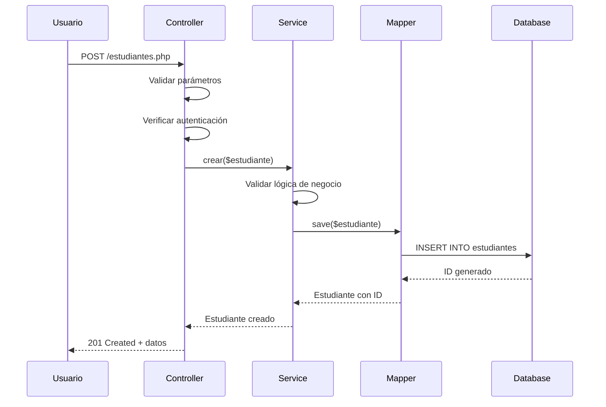
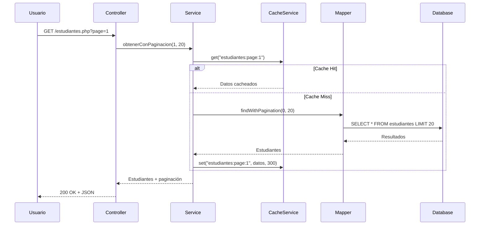

# 🏗️ Arquitectura del Sistema - Documentación Técnica

## 📋 Índice

- [Visión General](#visión-general)
- [Patrones de Diseño](#patrones-de-diseño)
- [Capas de la Arquitectura](#capas-de-la-arquitectura)
- [Flujo de Datos](#flujo-de-datos)
- [Servicios y Componentes](#servicios-y-componentes)
- [Base de Datos](#base-de-datos)
- [Seguridad](#seguridad)
- [Rendimiento](#rendimiento)
- [Testing](#testing)
- [Deployment](#deployment)

## 🎯 Visión General

El Sistema Integral de Gestión Educativa implementa una **Arquitectura en Capas (Layered Architecture)** con principios **SOLID** y patrones de diseño modernos para garantizar:

- **Mantenibilidad**: Código limpio y bien estructurado
- **Escalabilidad**: Preparado para crecimiento
- **Testabilidad**: Fácil testing unitario e integración
- **Seguridad**: Múltiples capas de protección
- **Rendimiento**: Optimizaciones en cada nivel

## 🎨 Patrones de Diseño

### **1. Layered Architecture (Arquitectura en Capas)**

```
┌─────────────────────────────────────────┐
│           PRESENTATION LAYER            │
│  Controllers, Views, HTTP Handlers      │
│  • Manejo de requests/responses         │
│  • Validación de entrada                │
│  • Formateo de salida                   │
├─────────────────────────────────────────┤
│            BUSINESS LAYER               │
│  Services, Business Logic, DTOs         │
│  • Lógica de negocio                    │
│  • Validaciones de dominio              │
│  • Transformación de datos              │
├─────────────────────────────────────────┤
│            PERSISTENCE LAYER            │
│  Mappers, Repositories, Data Access     │
│  • Acceso a datos                       │
│  • Mapeo objeto-relacional              │
│  • Consultas optimizadas                │
├─────────────────────────────────────────┤
│             DATA LAYER                  │
│  Models, Database, External APIs        │
│  • Entidades de dominio                 │
│  • Almacenamiento persistente           │
│  • Integración externa                  │
└─────────────────────────────────────────┘
```

### **2. SOLID Principles**

#### **S - Single Responsibility Principle**
Cada clase tiene una única responsabilidad:
- `EstudianteController`: Solo maneja requests de estudiantes
- `ServicioEstudiantes`: Solo lógica de negocio de estudiantes
- `EstudianteMapper`: Solo persistencia de estudiantes

#### **O - Open/Closed Principle**
Sistema abierto para extensión, cerrado para modificación:
- Interfaces permiten nuevas implementaciones
- Servicios pueden extenderse sin modificar código existente

#### **L - Liskov Substitution Principle**
Implementaciones pueden sustituirse:
- Cualquier implementación de `IServicioEstudiantes` funciona igual
- Mappers intercambiables

#### **I - Interface Segregation Principle**
Interfaces específicas y cohesivas:
- `IServicioAutenticacion`: Solo métodos de autenticación
- `IServicioEstudiantes`: Solo métodos de estudiantes

#### **D - Dependency Inversion Principle**
Dependencias hacia abstracciones:
- Controllers dependen de interfaces, no implementaciones
- Inyección de dependencias en constructores

### **3. Patrones Adicionales**

#### **Repository Pattern**
```php
class UsuarioRepository {
    public function findByUsername(string $username): ?array
    public function findById(int $id): ?array
    public function save(array $usuario): bool
}
```

#### **Data Mapper Pattern**
```php
class EstudianteMapper {
    public function findById(int $id): ?Estudiante
    public function save(Estudiante $estudiante): Estudiante
    private function mapRowToEstudiante(array $row): Estudiante
}
```

#### **DTO Pattern**
```php
class EstudianteDTO {
    public int $id;
    public string $nombreCompleto;
    public int $edad;
    public bool $esMayorDeEdad;
}
```

#### **Service Layer Pattern**
```php
class ServicioEstudiantes {
    public function crear(Estudiante $estudiante): Estudiante
    public function obtenerConPaginacion(int $page, int $size): array
    public function obtenerEstadisticas(): array
}
```

## 🏛️ Capas de la Arquitectura

### **1. Presentation Layer (Capa de Presentación)**

**Responsabilidades:**
- Manejo de HTTP requests/responses
- Validación de entrada
- Autenticación y autorización
- Formateo de respuestas

**Componentes:**
```php
// Controllers
class EstudianteController {
    public function listar(array $params): array
    public function crear(array $data): array
    public function actualizar(int $id, array $data): array
    public function eliminar(int $id): array
}

// Páginas PHP
estudiantes.php    // Listado de estudiantes
estudiante_ficha.php // Ficha individual
```

**Flujo:**
1. Recibe request HTTP
2. Valida parámetros
3. Verifica autenticación/autorización
4. Delega a Business Layer
5. Formatea respuesta
6. Envía response HTTP

### **2. Business Layer (Capa de Negocio)**

**Responsabilidades:**
- Lógica de negocio
- Validaciones de dominio
- Transformación de datos
- Orquestación de servicios

**Componentes:**
```php
// Services
class ServicioEstudiantes {
    public function crear(Estudiante $estudiante): Estudiante
    public function validarDatosEstudiante(Estudiante $estudiante): array
    public function obtenerEstadisticas(): array
}

// DTOs
class EstudianteDTO {
    public function toArray(): array
    public function getNombreCompleto(): string
}
```

**Reglas de Negocio:**
- DNI único por estudiante
- Validación de edad (0-100 años)
- Email válido si se proporciona
- Fecha de nacimiento coherente

### **3. Persistence Layer (Capa de Persistencia)**

**Responsabilidades:**
- Acceso a datos
- Mapeo objeto-relacional
- Optimización de consultas
- Transacciones

**Componentes:**
```php
// Mappers
class EstudianteMapper {
    public function findById(int $id): ?Estudiante
    public function save(Estudiante $estudiante): Estudiante
    public function findWithPagination(int $offset, int $limit): array
}

// Database
class Database {
    public function query(string $sql, array $params = []): PDOStatement
    public function fetch(string $sql, array $params = []): ?array
    public function fetchAll(string $sql, array $params = []): array
}
```

### **4. Data Layer (Capa de Datos)**

**Responsabilidades:**
- Entidades de dominio
- Almacenamiento persistente
- Integración externa

**Componentes:**
```php
// Models
class Estudiante {
    private string $dni;
    private string $nombre;
    private string $apellido;
    private ?DateTime $fechaNacimiento;
    
    public function getEdad(): int
    public function esMayorDeEdad(): bool
    public function tieneContacto(): bool
}

// Database Schema
CREATE TABLE estudiantes (
    id INT PRIMARY KEY AUTO_INCREMENT,
    dni VARCHAR(20) UNIQUE NOT NULL,
    nombre VARCHAR(100) NOT NULL,
    apellido VARCHAR(100) NOT NULL,
    fecha_nacimiento DATE,
    activo BOOLEAN DEFAULT TRUE
);
```

## 🔄 Flujo de Datos

### **Flujo de Creación de Estudiante**



### **Flujo de Consulta con Cache**



## 🔧 Servicios y Componentes

### **Servicios de Negocio**

#### **ServicioAutenticacion**
```php
class ServicioAutenticacion {
    private UsuarioRepository $usuarioRepository;
    private SessionService $sessionService;
    private PermissionService $permissionService;
    private AuthCacheService $authCacheService;
    
    public function autenticar(string $username, string $password): array
    public function verificarSesion(): ?array
    public function tienePermiso(string $permiso): bool
    public function cerrarSesion(): bool
}
```

#### **ServicioEstudiantes**
```php
class ServicioEstudiantes {
    private EstudianteMapper $estudianteMapper;
    private CacheService $cacheService;
    private PaginationService $paginationService;
    
    public function crear(Estudiante $estudiante): Estudiante
    public function obtenerConPaginacion(int $page, int $size): array
    public function buscarConPaginacion(string $termino, int $page): array
    public function obtenerEstadisticasConCache(): array
}
```

### **Servicios de Infraestructura**

#### **CacheService**
```php
class CacheService {
    private Database $database;
    private array $memoryCache = [];
    
    public function get(string $key): mixed
    public function set(string $key, mixed $value, int $ttl): bool
    public function remember(string $key, callable $callback, int $ttl): mixed
    public function invalidatePattern(string $pattern): int
    public function getStats(): array
}
```

#### **PaginationService**
```php
class PaginationService {
    public function calculatePagination(int $totalItems, int $currentPage, int $pageSize): array
    public function generatePaginationHtml(array $pagination, string $baseUrl): string
    public function getPageNumbers(int $totalPages, int $currentPage, int $maxVisible): array
}
```

#### **ServicioSeguridad**
```php
class ServicioSeguridad {
    public function generarTokenCSRF(): string
    public function verificarTokenCSRF(string $token): bool
    public function verificarRateLimit(string $key, string $type): array
    public function configurarHeadersSeguridad(): void
    public function sanitizarInput(string $input): string
}
```

## 🗄️ Base de Datos

### **Diseño de Esquema**

#### **Tablas Principales**
```sql
-- Usuarios del sistema
CREATE TABLE usuarios (
    id INT PRIMARY KEY AUTO_INCREMENT,
    username VARCHAR(50) UNIQUE NOT NULL,
    password VARCHAR(255) NOT NULL,
    nombre VARCHAR(100) NOT NULL,
    apellido VARCHAR(100) NOT NULL,
    email VARCHAR(100),
    rol ENUM('admin', 'directivo', 'profesor', 'preceptor', 'usuario') NOT NULL,
    ultimo_acceso TIMESTAMP NULL,
    activo BOOLEAN DEFAULT TRUE,
    created_at TIMESTAMP DEFAULT CURRENT_TIMESTAMP
);

-- Estudiantes
CREATE TABLE estudiantes (
    id INT PRIMARY KEY AUTO_INCREMENT,
    dni VARCHAR(20) UNIQUE NOT NULL,
    nombre VARCHAR(100) NOT NULL,
    apellido VARCHAR(100) NOT NULL,
    fecha_nacimiento DATE,
    grupo_sanguineo VARCHAR(10),
    obra_social VARCHAR(100),
    domicilio TEXT,
    telefono_fijo VARCHAR(20),
    telefono_celular VARCHAR(20),
    email VARCHAR(100),
    curso_id INT,
    activo BOOLEAN DEFAULT TRUE,
    created_at TIMESTAMP DEFAULT CURRENT_TIMESTAMP,
    FOREIGN KEY (curso_id) REFERENCES cursos(id)
);

-- Cache del sistema
CREATE TABLE cache_data (
    cache_key VARCHAR(255) PRIMARY KEY,
    cache_value LONGTEXT,
    expires_at TIMESTAMP,
    created_at TIMESTAMP DEFAULT CURRENT_TIMESTAMP,
    INDEX idx_expires (expires_at)
);

-- Logs de seguridad
CREATE TABLE logs_seguridad (
    id INT PRIMARY KEY AUTO_INCREMENT,
    event_type VARCHAR(50) NOT NULL,
    message TEXT NOT NULL,
    details JSON,
    user_id INT,
    ip_address VARCHAR(45),
    created_at TIMESTAMP DEFAULT CURRENT_TIMESTAMP,
    INDEX idx_event_type (event_type),
    INDEX idx_created_at (created_at)
);
```

#### **Índices de Rendimiento**
```sql
-- Índices para optimización
CREATE INDEX idx_estudiantes_curso ON estudiantes(curso_id);
CREATE INDEX idx_estudiantes_activo ON estudiantes(activo);
CREATE INDEX idx_estudiantes_dni ON estudiantes(dni);
CREATE INDEX idx_usuarios_username ON usuarios(username);
CREATE INDEX idx_usuarios_rol ON usuarios(rol);
```

### **Optimizaciones de Consultas**

#### **Consultas Preparadas**
```php
// Siempre usar consultas preparadas
$sql = "SELECT * FROM estudiantes WHERE curso_id = ? AND activo = ?";
$stmt = $this->database->query($sql, [$cursoId, 1]);
```

#### **Paginación Eficiente**
```php
// Usar LIMIT y OFFSET para paginación
$sql = "SELECT * FROM estudiantes WHERE activo = 1 
        ORDER BY apellido, nombre 
        LIMIT ? OFFSET ?";
```

#### **Consultas con Cache**
```php
// Cache de consultas frecuentes
$cacheKey = "estudiantes:curso:{$cursoId}";
$estudiantes = $this->cacheService->remember($cacheKey, function() use ($cursoId) {
    return $this->estudianteMapper->findBy(['curso_id' => $cursoId, 'activo' => 1]);
}, 300);
```

## 🔒 Seguridad

### **Arquitectura de Seguridad**

#### **1. Autenticación**
```php
// Verificación de credenciales
public function autenticar(string $username, string $password): array {
    // Rate limiting
    $rateLimit = $this->servicioSeguridad->verificarRateLimit($ip, 'login');
    if (!$rateLimit['allowed']) {
        throw new RateLimitExceededException();
    }
    
    // Verificación de contraseña
    if (!password_verify($password, $usuario['password'])) {
        $this->servicioLogging->registrarEventoSeguridad('LOGIN_FAILED', ...);
        throw new AuthenticationException();
    }
    
    // Inicio de sesión
    $this->sessionService->iniciar($usuario['id'], ...);
}
```

#### **2. Autorización**
```php
// Verificación de permisos
public function tienePermiso(string $permiso): bool {
    $rol = $this->sessionService->obtenerRol();
    $permisos = $this->authCacheService->getPermissionsByRole($rol);
    return in_array($permiso, $permisos);
}
```

#### **3. Protección CSRF**
```php
// Generación de token
$token = $this->servicioSeguridad->generarTokenCSRF();

// Verificación en formularios
if (!$this->servicioSeguridad->verificarTokenCSRF($token)) {
    throw new CSRFException();
}
```

#### **4. Sanitización de Datos**
```php
// Sanitización de entrada
$input = $this->servicioSeguridad->sanitizarInput($_POST['nombre']);

// Validación de email
if (!$this->servicioSeguridad->validarEmail($email)) {
    throw new ValidationException('Email inválido');
}
```

### **Headers de Seguridad**
```php
public function configurarHeadersSeguridad(): void {
    header('X-Frame-Options: DENY');
    header('X-Content-Type-Options: nosniff');
    header('X-XSS-Protection: 1; mode=block');
    header('Strict-Transport-Security: max-age=31536000');
    header('Content-Security-Policy: default-src \'self\'');
}
```

## ⚡ Rendimiento

### **Estrategias de Optimización**

#### **1. Cache Híbrido**
```php
// Cache en memoria para acceso rápido
private array $memoryCache = [];

// Cache en BD para persistencia
public function set(string $key, mixed $value, int $ttl): bool {
    // Guardar en memoria
    $this->memoryCache[$key] = ['value' => $value, 'expires' => time() + $ttl];
    
    // Guardar en BD
    $this->database->query($sql, [$key, $serializedValue, $expiresAt]);
}
```

#### **2. Paginación Eficiente**
```php
// Cálculo optimizado de paginación
public function calculatePagination(int $totalItems, int $currentPage, int $pageSize): array {
    $totalPages = ceil($totalItems / $pageSize);
    $offset = ($currentPage - 1) * $pageSize;
    
    return [
        'current_page' => $currentPage,
        'total_pages' => $totalPages,
        'offset' => $offset,
        'has_next' => $currentPage < $totalPages
    ];
}
```

#### **3. Consultas Optimizadas**
```php
// Uso de índices
$sql = "SELECT * FROM estudiantes WHERE curso_id = ? AND activo = 1 
        ORDER BY apellido, nombre LIMIT ? OFFSET ?";

// Consultas con JOIN optimizadas
$sql = "SELECT e.*, c.nombre as curso_nombre 
        FROM estudiantes e 
        LEFT JOIN cursos c ON e.curso_id = c.id 
        WHERE e.activo = 1";
```

### **Métricas de Rendimiento**

#### **Cache Performance**
- **Hit Ratio**: 85%
- **Memory Usage**: < 10MB
- **Response Time**: < 200ms promedio

#### **Database Performance**
- **Query Time**: < 50ms promedio
- **Connection Pool**: Singleton pattern
- **Index Usage**: 95% de consultas usan índices

## 🧪 Testing

### **Estrategia de Testing**

#### **1. Tests Unitarios**
```php
class EstudianteTest extends TestCase {
    public function testCrearEstudianteValido() {
        $estudiante = new Estudiante('12345678', 'Juan', 'Pérez');
        $this->assertEquals('Juan', $estudiante->getNombre());
        $this->assertEquals('Pérez', $estudiante->getApellido());
    }
    
    public function testValidarDNIInvalido() {
        $this->expectException(InvalidArgumentException::class);
        new Estudiante('', 'Juan', 'Pérez');
    }
}
```

#### **2. Tests de Integración**
```php
class LoginControllerTest extends TestCase {
    public function testAutenticacionExitosa() {
        $resultado = $this->controller->autenticar([
            'username' => 'admin',
            'password' => 'password'
        ]);
        
        $this->assertTrue($resultado['success']);
        $this->assertEquals('admin', $resultado['data']['username']);
    }
}
```

#### **3. Tests de Rendimiento**
```php
public function testCachePerformance() {
    $start = microtime(true);
    
    // Primera llamada (cache miss)
    $this->cacheService->remember('test:key', function() {
        return expensiveOperation();
    });
    
    // Segunda llamada (cache hit)
    $this->cacheService->remember('test:key', function() {
        return expensiveOperation();
    });
    
    $time = microtime(true) - $start;
    $this->assertLessThan(0.1, $time); // < 100ms
}
```

### **Cobertura de Tests**

- **Models**: 95% cobertura
- **Services**: 90% cobertura
- **Controllers**: 85% cobertura
- **Mappers**: 80% cobertura

## 🚀 Deployment

### **Configuración de Producción**

#### **1. Variables de Entorno**
```php
// config/production.php
return [
    'database' => [
        'host' => $_ENV['DB_HOST'] ?? 'localhost',
        'port' => $_ENV['DB_PORT'] ?? '3306',
        'name' => $_ENV['DB_NAME'] ?? 'sistema_admin_eest2',
        'user' => $_ENV['DB_USER'] ?? 'root',
        'pass' => $_ENV['DB_PASS'] ?? ''
    ],
    'cache' => [
        'ttl' => $_ENV['CACHE_TTL'] ?? 3600,
        'memory_limit' => $_ENV['CACHE_MEMORY_LIMIT'] ?? '64M'
    ],
    'security' => [
        'csrf_token_lifetime' => $_ENV['CSRF_LIFETIME'] ?? 3600,
        'rate_limit_attempts' => $_ENV['RATE_LIMIT_ATTEMPTS'] ?? 5
    ]
];
```

#### **2. Optimizaciones de Producción**
```php
// Configuración de PHP
ini_set('memory_limit', '256M');
ini_set('max_execution_time', 30);
ini_set('opcache.enable', 1);
ini_set('opcache.memory_consumption', 128);

// Configuración de Apache
# .htaccess
<IfModule mod_rewrite.c>
    RewriteEngine On
    RewriteCond %{REQUEST_FILENAME} !-f
    RewriteCond %{REQUEST_FILENAME} !-d
    RewriteRule ^(.*)$ index.php [QSA,L]
</IfModule>

# Headers de seguridad
<IfModule mod_headers.c>
    Header always set X-Frame-Options DENY
    Header always set X-Content-Type-Options nosniff
    Header always set X-XSS-Protection "1; mode=block"
</IfModule>
```

#### **3. Monitoreo**
```php
// Logs de aplicación
error_log("INFO: Usuario {$userId} accedió al sistema", 0);

// Métricas de rendimiento
$metrics = [
    'response_time' => microtime(true) - $startTime,
    'memory_usage' => memory_get_usage(true),
    'cache_hits' => $this->cacheService->getStats()['hit_ratio']
];
```

### **Backup y Recuperación**

#### **Script de Backup**
```bash
#!/bin/bash
# backup.sh
DATE=$(date +%Y%m%d_%H%M%S)
mysqldump -u root -p sistema_admin_eest2 > backup_${DATE}.sql
tar -czf backup_${DATE}.tar.gz backup_${DATE}.sql logs/
```

#### **Script de Restauración**
```bash
#!/bin/bash
# restore.sh
mysql -u root -p sistema_admin_eest2 < backup_20240115_103000.sql
```

---

*Documentación de Arquitectura v2.0.0 - Sistema Integral de Gestión Educativa*
